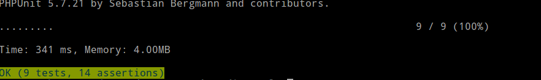
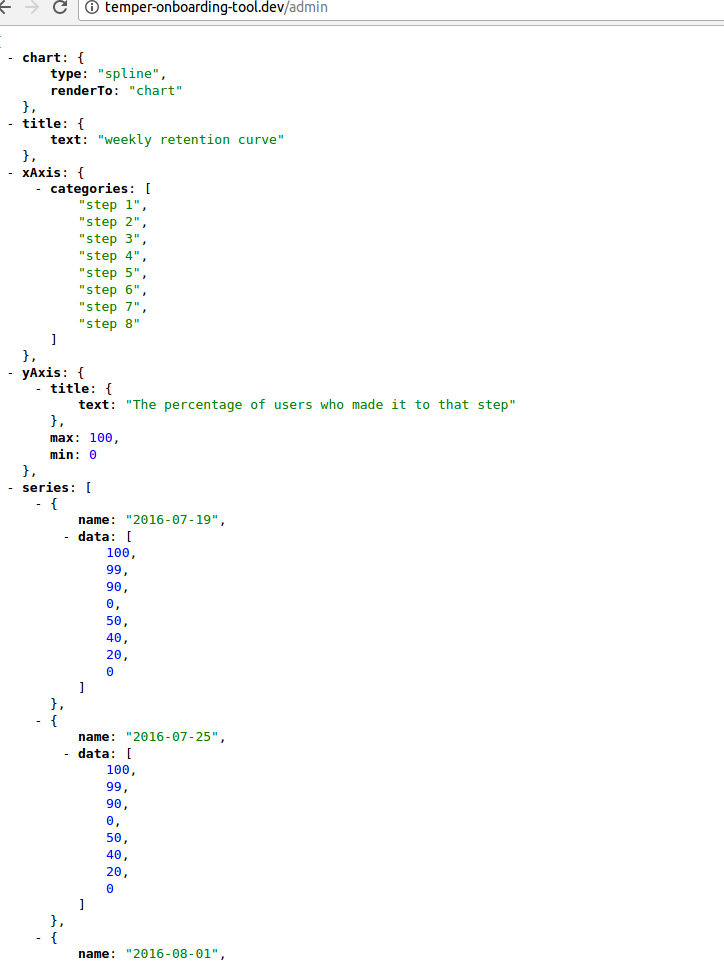
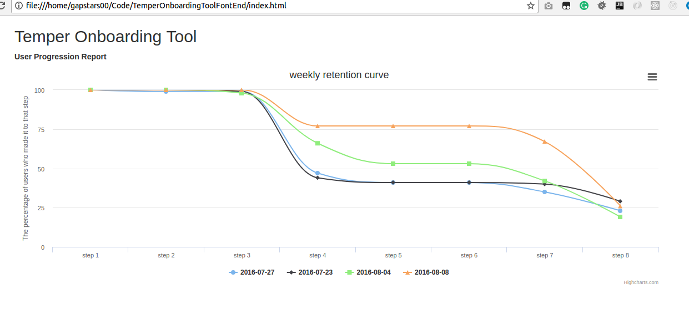

# Important
>Please Run the Backend Tool before executing the Front end.
## Server installation and setup

Here I am using laravel homestead, Please follow instruction on following official link and install
[https://laravel.com/docs/5.4/homestead#installation-and-setup](https://laravel.com/docs/5.4/homestead#installation-and-setup) 

### Configure Homestead to setup application
> This step should be executed from the host machine not inside Vagrant Homestead

In this step we'll re-configure Homestead to create new site and database 

linux: 
```
nano ~/.homestead/Homestead.yaml
```
Under the tag of sites: add new mapping
```
- map: temper-onboarding-tool.dev
  to: /home/vagrant/Code/TemperOnboardingTool/public
```
> Please note that my application source code placed inside ~/Code directory.

Under the tag of databases: add new database
```
- temper-onboarding-tool
```
Re-provision our vagrant machine 
to make Homestead create the website and database we just configured above.
```
vagrant reload --provision
```

###  Configure Application domain
   Add application domain names in your local machine hosts file to point to the Vagrant machine IP address:

linux:
```
sudo nano /etc/hosts
```

```
192.168.10.10   temper-onboarding-tool.dev
```

## Composer Install Required.
```
composer install
```

composer.lock file attached with source code :)

## Migration
```
php artisan migrate
```

## Seed CSV into Database
visit http://temper-onboarding-tool.dev/import

> Run it only once (needs to be imrpoved).

## PHPUnit 



## See on action
visit http://temper-onboarding-tool.dev/admin

JSON Response: 


## Front End.
Minimal version available in the directory `TemperOnboardingToolFontEnd`
 
 If you open the index.html file in the browser you will see following.
 
Admin Dashboard: 



## Futher modification
MH Rilwan rilwanfit@gmail.com
